<div align="center">


# ChargeGrid

**Dispečerský dashboard pro síť nabíjecích stanic elektromobilů**

Živá telemetrie přes WebSocket · historie provozu · alarmy · administrace

[](https://github.com/BartosStore/charge-grid/actions/workflows/ci.yml)


<br>

<picture>
  <source media="(prefers-color-scheme: light)" srcset="docs/screenshots/overview-light.png">
  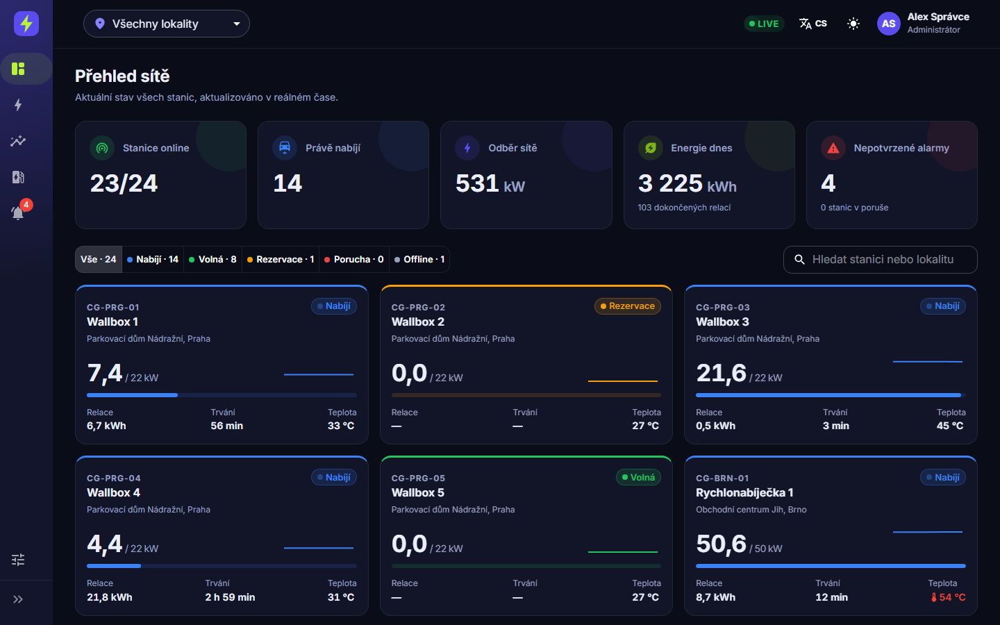
</picture>

</div>

## O projektu

ChargeGrid je ukázková webová aplikace pro operátory fiktivní sítě 24 nabíjecích stanic v šesti českých městech. Dispečer v ní vidí aktuální stav každé stanice, sleduje výkon a teplotu v reálném čase, prochází historii provozu, řeší poruchy a spravuje stanice, lokality, tarify i uživatele.

Aplikace **nepotřebuje žádný backend**. REST API i WebSocket stream obsluhuje [MSW](https://mswjs.io/) přímo v prohlížeči a data vyrábí deterministický simulátor. Stačí `npm install && npm run dev` a všechno běží.

> [!NOTE]
> Všechna data jsou smyšlená. Stanice, relace, tržby i alarmy generuje simulátor podle jednoduchého fyzikálního modelu.

### Na co se podívat

- ⚡ **Skutečný real-time.** Graf naváže historii z REST API na WebSocket stream bez skoku. Sdílené připojení přes `useSyncExternalStore` se samo obnoví po výpadku.
- 🎲 **Deterministická data.** Každý den každé stanice má vlastní seed, takže historie, živá data a statistiky do sebe zapadají a po obnovení stránky se nezmění.
- 📊 **Grafy, které unesou objem dat.** ECharts kreslí do canvasu: časové řady se zoomem, stavová osa všech stanic, skládané sloupce. Importuje se jen to, co aplikace používá.
- 🔐 **Role a oprávnění.** Admin, operátor a čtenář vidí různé věci. Alarmy potvrzuje operátor nebo admin, administraci vidí jen admin.
- 🌗 **Detaily, které dělají produkt.** Světlý i tmavý režim, čeština a angličtina, globální filtr lokality, mobilní layout se spodní navigací, export do CSV, lazy loading stránek.
- ✅ **Otestováno.** Unit testy (Vitest + Testing Library), E2E test v Playwrightu a CI na GitHub Actions u každého pushe.

## Ukázky

<table>
  <tr>
    <td width="50%">
      <picture>
        <source media="(prefers-color-scheme: light)" srcset="docs/screenshots/live-light.png">
        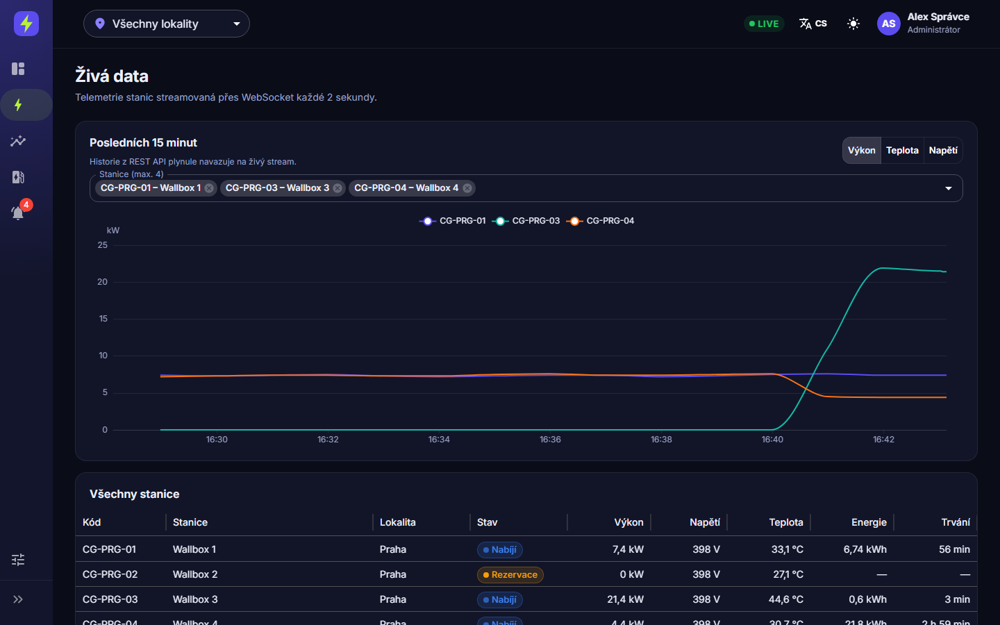
      </picture>
      <p align="center"><b>Živá data</b><br><sub>Posledních 15 minut, výkon / teplota / napětí, aktualizace každé 2 s</sub></p>
    </td>
    <td width="50%">
      <picture>
        <source media="(prefers-color-scheme: light)" srcset="docs/screenshots/history-light.png">
        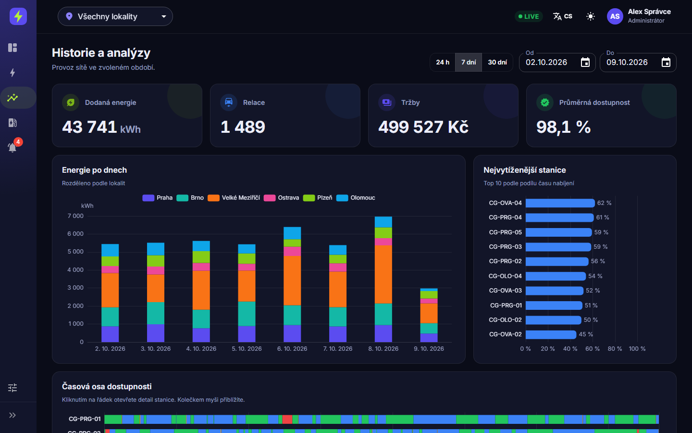
      </picture>
      <p align="center"><b>Historie a analýzy</b><br><sub>Energie po dnech podle lokalit, žebříček vytížení, časová osa dostupnosti</sub></p>
    </td>
  </tr>
  <tr>
    <td width="50%">
      <picture>
        <source media="(prefers-color-scheme: light)" srcset="docs/screenshots/station-light.png">
        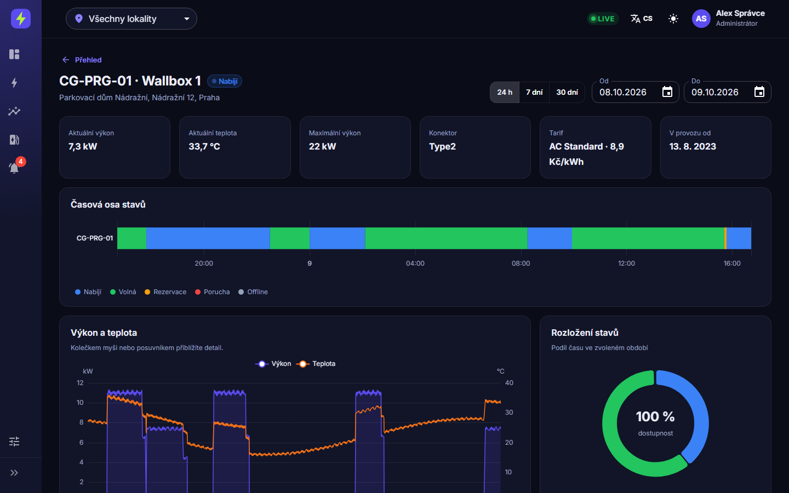
      </picture>
      <p align="center"><b>Detail stanice</b><br><sub>Stavová osa, výkon a teplota se zoomem, rozložení stavů</sub></p>
    </td>
    <td width="50%">
      <picture>
        <source media="(prefers-color-scheme: light)" srcset="docs/screenshots/sessions-light.png">
        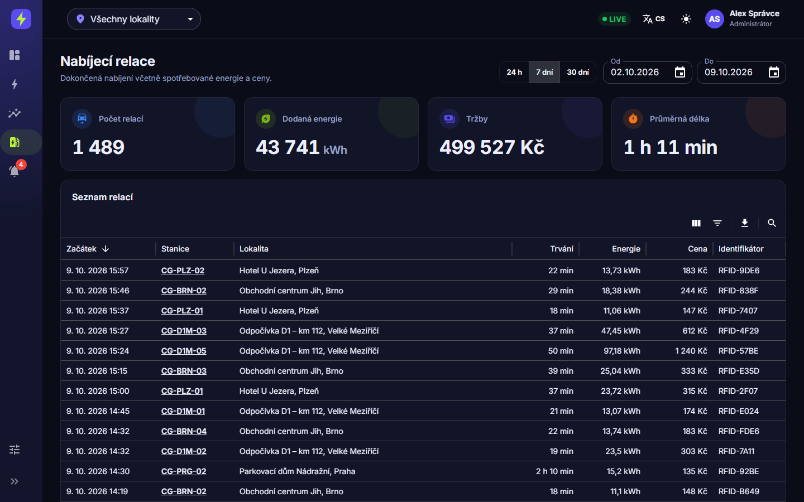
      </picture>
      <p align="center"><b>Nabíjecí relace</b><br><sub>Filtrování, řazení a export do CSV</sub></p>
    </td>
  </tr>
  <tr>
    <td width="50%">
      <picture>
        <source media="(prefers-color-scheme: light)" srcset="docs/screenshots/alarms-light.png">
        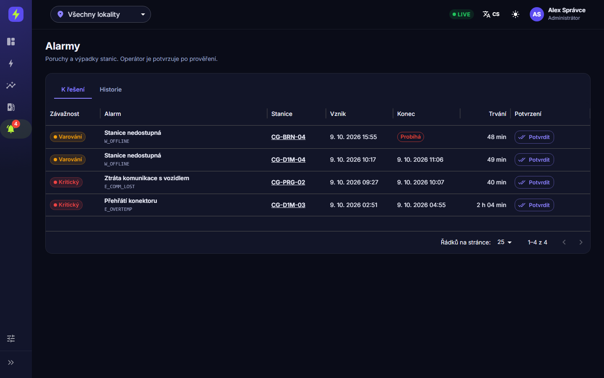
      </picture>
      <p align="center"><b>Alarmy</b><br><sub>Aktivní a historické poruchy, potvrzování podle role</sub></p>
    </td>
    <td width="50%">
      <picture>
        <source media="(prefers-color-scheme: light)" srcset="docs/screenshots/admin-light.png">
        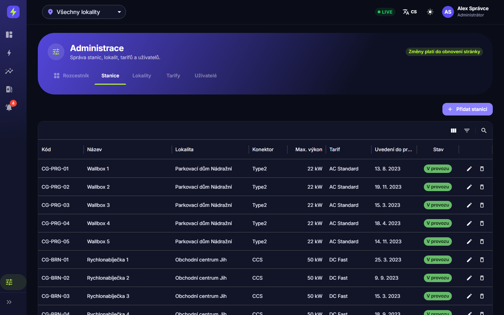
      </picture>
      <p align="center"><b>Administrace</b><br><sub>CRUD stanic, lokalit, tarifů a uživatelů</sub></p>
    </td>
  </tr>
</table>

<details>
<summary><b>📱 Mobilní zobrazení</b></summary>
<br>
<p align="center">
  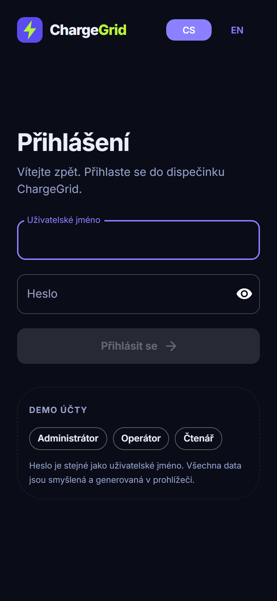
  &nbsp;
  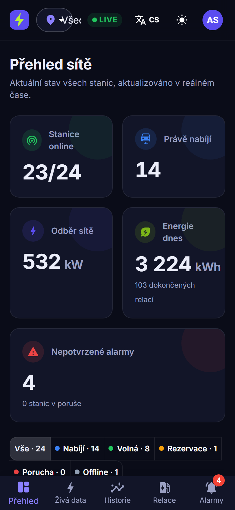
  &nbsp;
  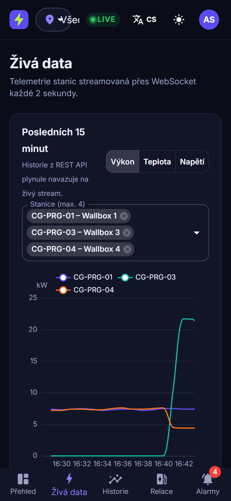
</p>
</details>

## Rychlý start

Potřebujete Node.js 22 nebo novější.

```bash
git clone https://github.com/BartosStore/charge-grid.git
cd charge-grid
npm install
npm run dev
```

Otevřete http://localhost:5173 a přihlaste se jedním z demo účtů. Heslo je vždy stejné jako jméno.

| Účet | Role | Co smí |
|---|---|---|
| `admin` | Administrátor | Všechno včetně administrace |
| `operator` | Operátor | Monitoring a potvrzování alarmů |
| `viewer` | Čtenář | Jen čtení |

## Funkce

| Obrazovka | Co ukazuje |
|---|---|
| **Přihlášení** | Demo účty s různými rolemi, přepínání jazyka |
| **Přehled** | KPI sítě a živé karty stanic (výkon, relace, teplota, sparkline), filtr podle stavu a hledání |
| **Živá data** | Graf posledních 15 minut. Historie z REST API plynule navazuje na WebSocket stream. Živá tabulka všech stanic. |
| **Historie** | Energie po dnech podle lokalit, žebříček vytížení, časová osa stavů všech stanic se zoomem |
| **Detail stanice** | Časová osa stavů, výkon a teplota s teplotním limitem, rozložení stavů, seznam relací |
| **Relace** | Tabulka nabíjecích relací s filtrováním, řazením a exportem do CSV |
| **Alarmy** | Aktivní a historické poruchy, potvrzování podle role |
| **Administrace** | CRUD stanic, lokalit, tarifů a uživatelů (jen pro admina) |

## Technologie

| Oblast | Nástroje |
|---|---|
| Základ | React 19, TypeScript, Vite |
| UI | MUI (Material UI, X Data Grid, X Date Pickers, X Charts pro sparklines), font Inter |
| Grafy | Apache ECharts s modulárním importem |
| Data a stav | TanStack Query pro serverová data, Redux Toolkit pro přihlášení a UI |
| Routing | React Router s lazy loadingem stránek |
| Lokalizace | i18next (cs / en) |
| Mock backend | MSW pro REST API i WebSocket |
| Kvalita | Vitest, Testing Library, Playwright, oxlint, GitHub Actions |

## Architektura

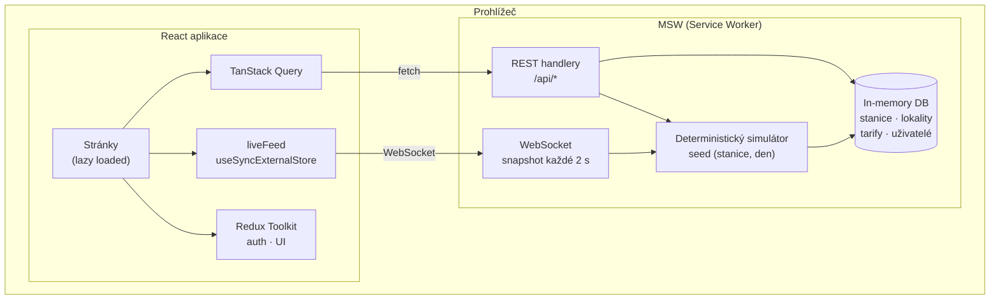

### Jak funguje mock backend

- **Stanice, lokality, tarify a uživatelé** jsou v paměti ([src/mocks/db.ts](src/mocks/db.ts)). Změny z administrace platí do obnovení stránky.
- **Časová osa stavů** každé stanice se generuje po dnech ze seedu `(stanice, den)`. Stejný dotaz tak vrací vždy stejná data a historie, živá data i statistiky jsou navzájem konzistentní.
- **Výkon, napětí a teplota** vycházejí z jednoduchého fyzikálního modelu: DC nabíjecí křivka s poklesem výkonu ke konci nabíjení, teplota podle zatížení a denní doby.
- **WebSocket** `wss://live.chargegrid.local/stream` posílá každé 2 sekundy snapshot všech stanic. Klient drží 15minutový buffer pro grafy a sparklines.

## Struktura projektu

```
src/
├── api/           typy, fetch klient, React Query hooky
├── live/          sdílené WebSocket připojení (useSyncExternalStore, reconnect)
├── mocks/         MSW handlery a deterministický generátor dat
├── components/    layout (navigační lišta, horní lišta), grafy, společné komponenty
├── pages/         stránky (lazy loaded), administrace
├── store/         Redux Toolkit (auth, UI)
├── theme/         MUI téma, barvy stavů
└── i18n/          překlady
e2e/               Playwright testy
docs/screenshots/  obrázky pro README
```

## Skripty

| Příkaz | Popis |
|---|---|
| `npm run dev` | Vývojový server |
| `npm run build` | Typová kontrola a produkční build do `dist/` |
| `npm run preview` | Náhled produkčního buildu |
| `npm run lint` | oxlint |
| `npm run typecheck` | TypeScript |
| `npm test` | Unit testy (Vitest) |
| `npm run test:e2e` | E2E testy (Playwright; poprvé je potřeba `npx playwright install chromium`) |

## Nasazení na GitHub Pages

Aplikace je čistě statická, takže ji lze hostovat kdekoli. Pro GitHub Pages se build sestaví pro podadresář repozitáře:

```bash
VITE_BASE=/charge-grid/ npm run build
cp dist/index.html dist/404.html   # SPA routing
```

---

<div align="center">
<sub>Vytvořil <a href="https://github.com/BartosStore">Miroslav Bartos</a> jako ukázkový projekt.</sub>
</div>
